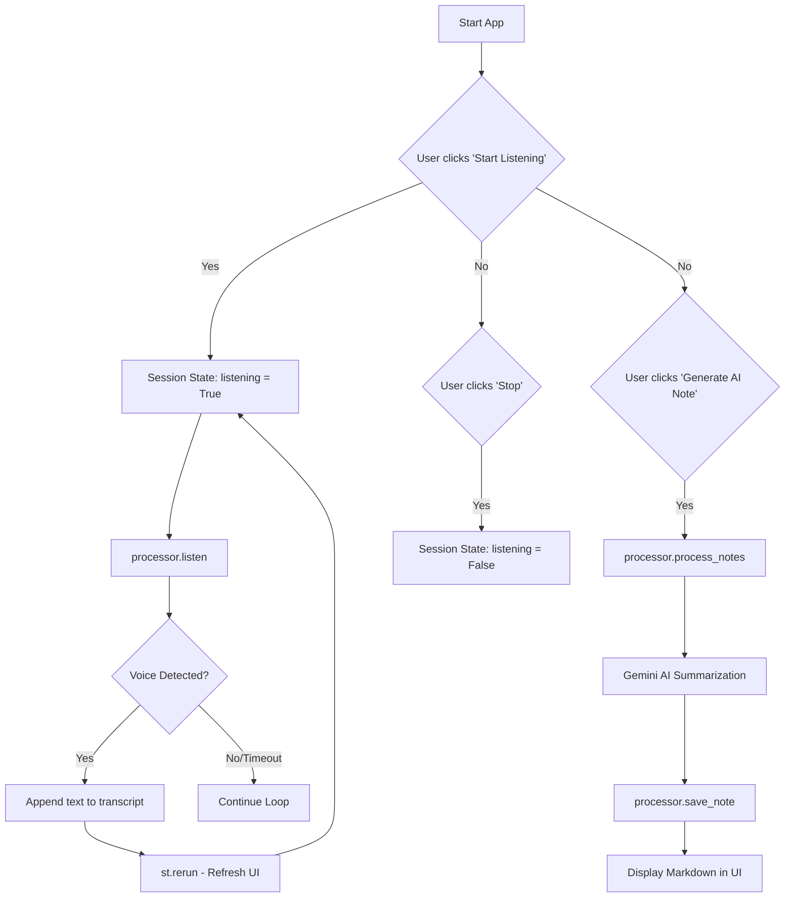

# EchoNote AI: Technical Documentation & Logic Flow

EchoNote AI is a real-time voice-to-structured-notes assistant. It leverages Google's Gemini 1.5 Flash for natural language processing and the `SpeechRecognition` library for audio-to-text conversion.

## 1. System Architecture

The project is split into two main components:
- **`processor.py` (The Engine):** Handles the "heavy lifting"—microphone access, speech-to-text, AI communication, and file I/O.
- **`app.py` (The Orchestrator):** A Streamlit web interface that manages the application state (UI, buttons, and real-time updates).

---

## 2. Python Logic Breakdown

### A. The Listening Loop (`processor.py` -> `listen()`)
The `listen` method uses the `SpeechRecognition` library to interact with your OS's microphone.
1.  **Ambient Noise Adjustment:** It takes a 0.5s sample of background noise to "calibrate" the microphone, ensuring it doesn't try to transcribe a humming fan.
2.  **Timeout & Phrase Limit:** 
    - `timeout`: How long it waits for you to *start* speaking.
    - `phrase_time_limit`: The maximum length of a single recording "chunk" (set to 4s-5s for better responsiveness).
3.  **Google Web Speech API:** It sends the captured audio snippet to Google's free web service to convert it into text.

### B. The AI Brain (`processor.py` -> `process_notes()`)
This is where the raw, messy transcript is turned into professional notes.
1.  **Prompt Engineering:** We wrap your transcript in a "System Prompt" that tells Gemini to act as a "Professional Note-Taker."
2.  **Gemini 1.5 Flash:** We use this model because it's optimized for speed and high-volume text processing. It identifies the "TL;DR," creates headers, and organizes bullet points.

### C. State Management (`app.py`)
Streamlit is "stateless" (it re-runs the whole script every time you click a button). We use `st.session_state` to bypass this:
- `st.session_state.transcript`: A list that stores every sentence captured so far.
- `st.session_state.listening`: A boolean (True/False) that tells the script whether to immediately re-trigger the `listen()` function after the current run finishes.

---

## 3. Logic Flow Diagram

---

## 4. Key Libraries
- **`streamlit`**: Used for the web UI. It's unique because the UI is written entirely in Python.
- **`SpeechRecognition`**: A wrapper for multiple speech APIs. We use the Google backend for out-of-the-box accuracy.
- **`PyAudio`**: The underlying engine that allows Python to "talk" to your hardware (microphone).
- **`google-generativeai`**: The official SDK for communicating with Gemini.
